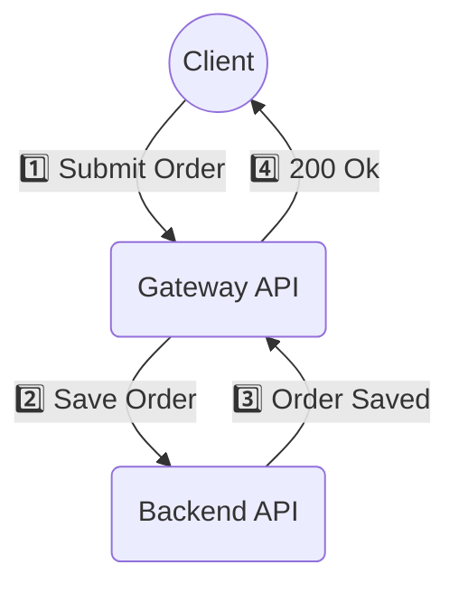

# [WIP] Asynchronous messaging in synchronous API's

## The problem

A Gateway API has been designed to accept orders. It's expected to receive a very high throughput of orders, which it must save to another system via a Backend API.

As performance testing starts, the results look promising. It seems the API meets the throughput requirements.

GRAPH

However, as the load continues to increase, something unexpected happens - beyond a certain point, throughput **decreases**!

GRAPH

### What's going on?

When the Gateway API makes a remote call, state needs to be stored in memory to resume processing upon receipt of the response. If the call takes a long time, the associated objects may survive multiple garbage collection (GC) cycles, potentially being promoted from Gen0 (short-lived objects) to Gen1 and eventually to Gen2 (long-lived objects). Since Gen2 collections are less frequent and more expensive, memory pressure in Gen2 can degrade performance.

Under high load, frequent promotions to Gen2 can trigger full GC cycles more often. During these cycles, the garbage collector suspends application threads to clean up memory, causing response times to increase. This feedback loop—longer response times causing more memory promotions—leads to increased GC activity and degraded throughput as the load increases.

## One (of many) solutions

One possible solution is to use **asynchronous messaging** to:
1. Decouple the "Submit Order" request at the Gateway API from the "Save Order" request at the Backend API, instead enqueuing a `SendOrder` message on a message queue.
   * **Tip:** Return a `202 Accepted` HTTP status instead of a `200 Ok`, indicating that the order has been received, but processing is incomplete.
1. Have a seperate process consume messages from the queue and save the order.
   * **Tip:** Ensure the consumer *limits concurrent message processing* to avoid the same issue faced by the synchronous implementation.

### Example

* [Async endpoint](https://github.com/benchiverton/AsyncApiDemo/blob/main/src/AsyncApiDemo.GatewayApi/Program.cs#L67)
* [Message consumer](https://github.com/benchiverton/AsyncApiDemo/tree/main/src/AsyncApiDemo.GatewayApi/SubmitOrderRequestConsumer.cs)

RESULTS / IMPROVEMENTS

### Limitations
* If the Backend API performs pre-processing (such as validation), you’ll need to implement error states within your domain model so that clients can query failed orders.
   * Consider performing basic validation at the Gateway API (e.g., duplicate checks) to prevent too many erroneous orders from entering the system.

## Appendix

### Raw test results

