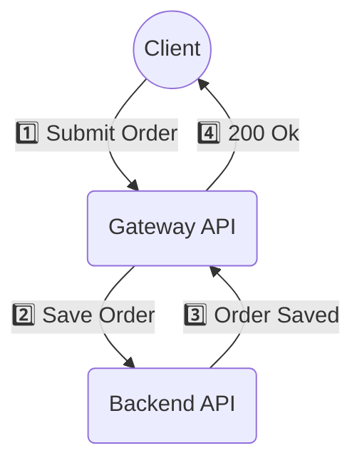

# [WIP] Asynchronous messaging in synchronous API's

## The problem

A Gateway API has been designed to accept orders. It's expected to receive a very high throughput of orders, which it must save to another system via a Backend API.

As performance testing starts, the results look promising. It seems the API meets the throughput requirements.

GRAPH

However, as the load continues to increase, something unexpected happens - beyond a certain point, throughput **decreases**!

GRAPH

### What's going on?

When the Gateway API makes a remote call, state needs to be stored in memory so that the program can continue upon receipt of the response. If this remote call is not almost instant, it’s very likely this memory will be promoted from Gen0 → Gen1 → Gen2 by the garbage collector. As Gen2 is not actively cleaned up by the garbage collector, this is problematic — even if a response is received, the memory may not be cleaned up.

Eventually, the garbage collector will suspend threads to clean up the Gen2 memory. As the app does not run while the garbage collector is active, the response time will start to increase.

As more requests arrive, this problem is compounded—response times increase, causing memory to be promoted to Gen2 faster. This results in the garbage collector suspending threads to clean up Gen2 memory more regularly, further increasing response times, increasing Gen2 memory, and so on. This feedback loop causes throughput to decrease as the load increases.

## One (of many) solutions

One possible solution is to use **asynchronous messaging** to:
1. Decouple the "Submit Order" request at the Gateway API from the "Save Order" request at the Backend API, instead enqueuing a `SendOrder` message on a message queue.
   * **Tip:** Return a `202 Accepted` HTTP status instead of a `200 Ok`, indicating that the order has been received, but processing is incomplete.
1. Have a seperate process consume messages from the queue and save the order.
   * **Tip:** Ensure the consumer *limits concurrent message processing* to avoid the same issue faced by the synchronous implementation.

### Example

[Async endpoint](../src/AsyncApiDemo.GatewayApi/Program.cs#67)
[Message consumer](../src/AsyncApiDemo.GatewayApi/SubmitOrderRequestConsumer.cs)

RESULTS

DIAGRAM

### Limitations
* If the Backend API performs pre-processing (such as validation), you’ll need to implement error states within your domain model so that clients can query failed orders.
   * Consider performing basic validation at the Gateway API (e.g., duplicate checks) to prevent too many erroneous orders from entering the system.

## Appendix

### Raw test results

